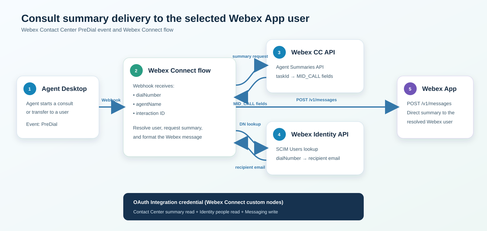
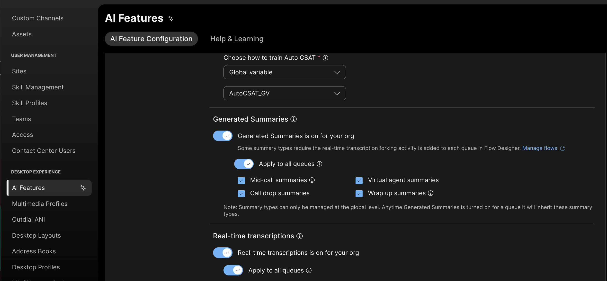
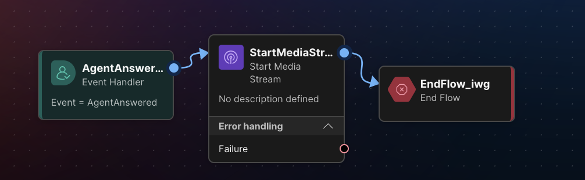
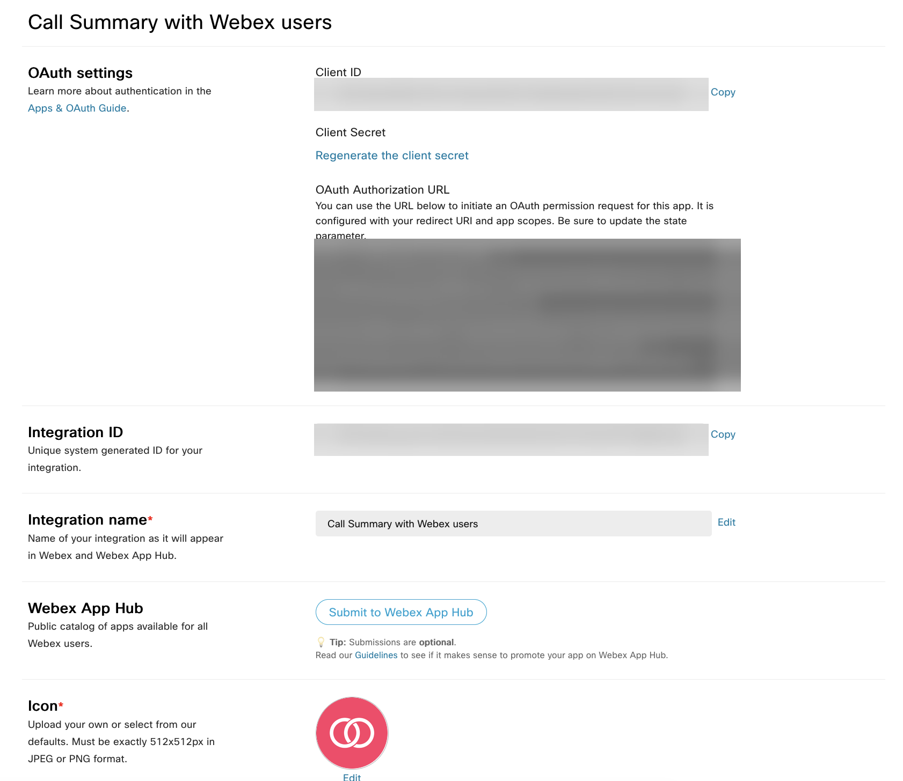
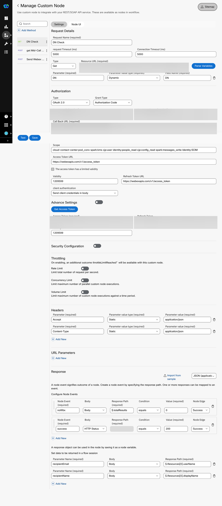
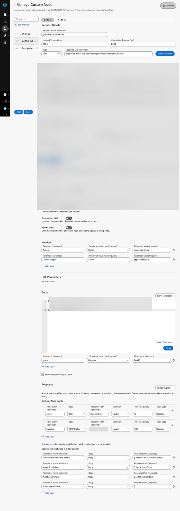
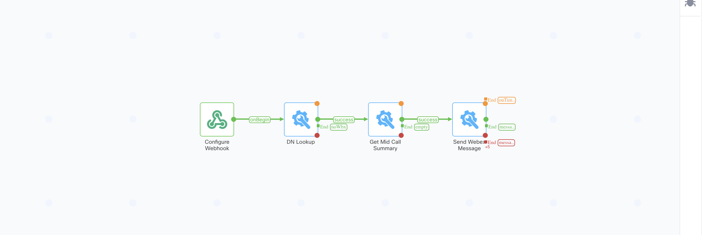
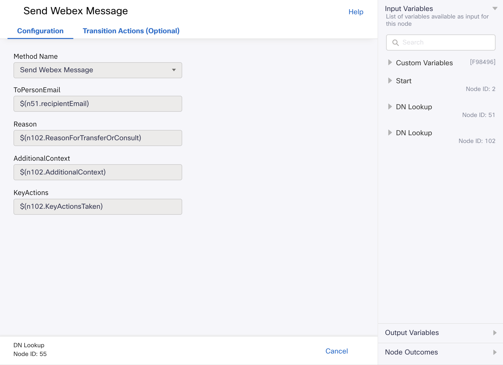
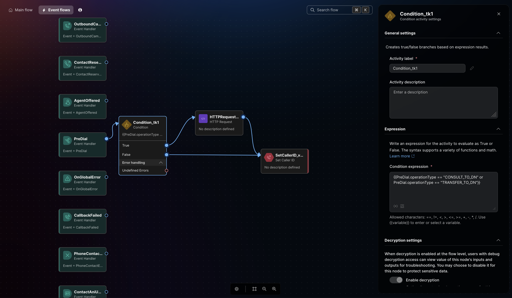

# Send Mid Call Consult Summaries to Webex Users with Flow Designer Event

## Summary

This playbook sends a Webex Contact Center AI-generated `MID_CALL` summary directly to the Webex user selected for a voice consultation or transfer.

It uses the Webex Contact Center `PreDial` event instead of a separately hosted webhook listener. Flow Designer sends the destination number and interaction ID to a Webex Connect webhook. Webex Connect resolves the destination number to a user, retrieves the current mid-call summary, and sends the summary as a direct Webex message.

This implementation does not use the Webex Contact Center Search API. The destination number is available directly as `PreDial.dialNumber`, and the Get Mid Call Summary custom-node method exposes the three summary fields as node outputs.



## Owner and maintenance

- Author: Dimitri Bokatov (`dbokatov`) and Kevin Simpson (`kevsimps`)
- Maintainer: FDE Team
- Last validated: 2026-09-23
- Version: 0.1.0

## Applicability

- Supported products: Webex Contact Center, Webex Connect, Webex Messaging, and Webex Identity
- Supported features: AI Assistant mid-call transfer summaries and real-time transcription
- Supported channel: Voice
- Intended audience: Webex Contact Center administrators, solution architects, and Webex Connect flow developers
- When to use: An agent consults or transfers to an organization user or dial number assigned to a Webex user, and that user should receive the current caller context privately
- When not to use: Queue, entry-point, shared-service, or other destinations that cannot be resolved to one eligible Webex user

The `PreDial` event runs before the consult or transfer leg connects. The message is therefore sent when dialing starts; this implementation does not confirm that the consulted user answered.

## Prerequisites

### Product configuration

- A Webex Contact Center voice tenant
- A Webex Connect service in the same solution environment
- Generated Summaries enabled for the organization or applicable queues
- Mid-call summaries enabled
- Real-time transcription enabled
- The inbound flow starts the required media stream after `AgentAnswered`
- Webex Messaging enabled for the integration user and consulted users
- Permission to edit and publish the Webex Contact Center inbound flow and its Event flows

### Integration user

Create a separate Webex user for this integration. The user must:

1. Belong to the same Control Hub organization as Webex Contact Center and the consulted Webex users.
2. Have a Webex Contact Center license.
3. Have the permissions required to authorize the Contact Center summary, identity lookup, and messaging requests.
4. Create and authorize the Webex Integration used by the Webex Connect custom nodes.
5. Be subject to the organization's normal MFA, access-review, and offboarding controls.

### Destination-number requirement

The destination must belong to a Webex user in the organization. The value received in `PreDial.dialNumber` must match a value in that user's SCIM `phoneNumbers` collection.

The comparison is format-sensitive. If the PreDial value contains a prefix or differs from the value stored in Webex Identity, normalize it before the DN Check request.

### OAuth scopes

The following OAuth scopes were validated together in the working implementation:

```text
cloud-contact-center:pod_conv spark:kms cjp:user identity:people_read cjp:config_read spark:messages_write
```

| Scope | Purpose |
|---|---|
| `cloud-contact-center:pod_conv` | Retrieve the current `MID_CALL` summary |
| `spark:kms` | Use the Webex Messaging encryption service |
| `cjp:user` | Provide the Webex Contact Center user authorization required by the tested integration |
| `identity:people_read` | Read identity information used by the destination-user lookup |
| `cjp:config_read` | Provide the Contact Center read authorization required by the tested configuration |
| `spark:messages_write` | Send the direct Webex message |

This implementation does not call the Webex Contact Center Search API. Although `cjp:config_read` is included in the validated scope set, it is not used here for a Search API request.

In the tested tenant, `Identity:SCIM` was not available in the Webex Integration OAuth scope picker. It was entered only in the Webex Connect custom-node scope settings. Use the six selectable scopes above in the Webex Integration consent request.

## Architecture and flow

```text
Agent starts a consult or transfer
              |
              v
Webex Contact Center PreDial event
              |
              | DN, agentName, taskId
              v
Webex Connect webhook
              |
              +--> DN Check
              |    Identity SCIM Users API
              |    DN -> recipientEmail
              |
              +--> Get Mid Call Summary
              |    Agent Summaries API
              |    taskId -> summary fields
              |
              +--> Send Webex Message
                   Messaging API
                   recipientEmail + summary
              |
              v
Consulted Webex user receives a direct message
```

The architecture intentionally contains no customer-hosted listener, Lambda function, database, or Search API request.

## Implementation

### 1. Enable generated summaries and transcription

In Webex Contact Center administration, open **AI Features** and confirm:

1. Generated Summaries is enabled.
2. Mid-call summaries is selected.
3. Real-time transcription is enabled.
4. The settings apply to the organization or the queues used in the test.
5. The inbound flow starts the media stream after `AgentAnswered`.





### 2. Create the Webex Integration

1. Sign in to [Webex for Developers](https://developer.webex.com) as the dedicated integration user.
2. Open **My Webex Apps**.
3. Select **Create a New App** and then **Create an Integration**.
4. Enter a descriptive name such as `Consult Summary Delivery from Flow Designer`.
5. Create the Webex Connect custom integration far enough to obtain its OAuth callback URL.
6. Add the Webex Connect callback URL as the Integration redirect URI.
7. Select the six OAuth scopes listed above.
8. Save the Integration.
9. Store the Client ID and Client Secret in an approved secret store.
10. Generate the OAuth authorization URL used by the Webex Connect custom nodes.



### 3. Create the Webex Connect custom integration

In Webex Connect, create one custom integration containing these methods:

| Method | Request | Purpose |
|---|---|---|
| DN Check | `GET` Identity SCIM Users | Resolve the dialed number to the Webex recipient email |
| Get Mid Call Summary | `POST` Agent Summaries search | Retrieve the interaction's `MID_CALL` summary |
| Send Webex Message | `POST` Webex Messages | Deliver the summary as Markdown and an Adaptive Card |

Reuse the same OAuth 2.0 Authorization Code configuration for all three methods.

#### Shared OAuth settings

| Setting | Value |
|---|---|
| Authorization type | OAuth 2.0 |
| Grant type | Authorization Code |
| Consumer ID | Client ID from the Webex Integration |
| Consumer secret | Client Secret from the Webex Integration |
| Callback URL | Generated by Webex Connect and registered as the Integration redirect URI |
| Authorization URL | Generated Webex OAuth authorization URL |
| Access token URL | `https://webexapis.com/v1/access_token` |
| Refresh token URL | `https://webexapis.com/v1/access_token` |
| Client authentication | Send client credentials in body |

Select **Get Access Token** and complete the consent flow. Never copy an access token or refresh token into a flow variable, screenshot, or documentation.

### 4. Configure DN Check

Use these settings:

| Setting | Value |
|---|---|
| Request name | DN Check |
| Method | `GET` |
| Resource URL | `https://webexapis.com/identity/scim/<ORG_ID>/v2/Users` |
| Input parameter | `DN`, dynamic string |
| Filter | `phoneNumbers.value eq "<DN>"` |
| Accept | `application/json` |
| Response type | JSON |

Encoded request URL:

```text
https://webexapis.com/identity/scim/<ORG_ID>/v2/Users?filter=phoneNumbers.value%20eq%20%22$(DN)%22
```

Create these output variables:

| Output | Response path |
|---|---|
| `recipientEmail` | `$.Resources[0].userName` |
| `recipientName` | `$.Resources[0].displayName` |
| `totalResults` | `$.totalResults` |

Create a `noWbx` outcome when `$.totalResults` equals `0`, and a success outcome when the HTTP status equals `200`.



### 5. Configure Get Mid Call Summary

Use these settings:

| Setting | Value |
|---|---|
| Request name | Get Mid Call Summary |
| Method | `POST` |
| Resource URL | `https://api.wxcc-us1.cisco.com/generated-summaries/search` |
| Content-Type | `application/json` |
| Accept | `application/json` |
| Input parameter | `taskId`, dynamic string |
| Response type | JSON |

Replace the hostname with the API hostname for the tenant region. Configure the body as follows:

```json
{
  "orgId": "<ORG_ID>",
  "interactionId": "$(taskId)",
  "searchType": "INTERACTION"
}
```

The identifier nested below `summaries.MID_CALL` changes for every interaction. Configure recursive response paths so the custom node returns scalar values without an Evaluate or JavaScript node:

| Output | Response path |
|---|---|
| `ReasonForTransferOrConsult` | `$..reasonForTransferOrConsult` |
| `AdditionalContext` | `$..additionalContext` |
| `KeyActionsTaken` | `$..keyActionsTaken` |

Create a success outcome for HTTP status `200`. If the summaries object is empty, route to a fallback message or a controlled retry.



### 6. Configure Send Webex Message

Use these settings:

| Setting | Value |
|---|---|
| Request name | Send Webex Message |
| Method | `POST` |
| Resource URL | `https://webexapis.com/v1/messages` |
| Content-Type | `application/json` |
| Accept | `application/json` |
| Response type | JSON |

Create the following dynamic inputs:

| Parameter | Source |
|---|---|
| `toPersonEmail` | `recipientEmail` from DN Check |
| `reason` | `ReasonForTransferOrConsult` from Get Mid Call Summary |
| `additionalContext` | `AdditionalContext` from Get Mid Call Summary |
| `keyActions` | `KeyActionsTaken` from Get Mid Call Summary |

Start with a Markdown-only request to confirm the recipient and values, then use the Adaptive Card request supplied in [`samples/adaptive-card.json`](samples/adaptive-card.json). Create a success outcome for HTTP status codes beginning with `20` and an error outcome for status codes beginning with `40`.


### 7. Build the Webex Connect flow

1. Create a new flow and select **Webhook** as the trigger category.
2. Copy the generated webhook URL to a secure location.
3. Provide and parse the sample payload in [`samples/webhook-request.json`](samples/webhook-request.json).
4. Add the nodes in this order: DN Lookup, Get Mid Call Summary, and Send Webex Message.
5. Connect success outcomes to the next node.
6. End cleanly when the DN lookup returns no user, the summary is unavailable, or the message fails.
7. Save the flow and make it live.



### 8. Map the Webex Connect flow variables

| Node | Input | Mapped value |
|---|---|---|
| DN Lookup | DN | Webhook `DN` |
| Get Mid Call Summary | TaskID | Webhook `taskId` |
| Send Webex Message | ToPersonEmail | DN Lookup `recipientEmail` |
| Send Webex Message | Reason | Get Mid Call Summary `ReasonForTransferOrConsult` |
| Send Webex Message | AdditionalContext | Get Mid Call Summary `AdditionalContext` |
| Send Webex Message | KeyActions | Get Mid Call Summary `KeyActionsTaken` |

Select the outputs in the Flow Designer variable picker instead of copying fixed node IDs. Node IDs differ between flows.



### 9. Configure the Flow Designer PreDial event

Open the inbound voice flow, select **Event flows**, and edit the `PreDial` event.

1. Add a Condition activity with this expression:

   ```text
   {{PreDial.operationType == "CONSULT_TO_DN" or PreDial.operationType == "TRANSFER_TO_DN"}}
   ```

2. Connect the True branch to an HTTP Request activity.
3. Connect the False branch back to the existing PreDial logic.
4. Configure the HTTP Request activity with the Webex Connect webhook URL, method `POST`, and content type `application/json`.
5. Use the request body from [`samples/webhook-request.json`](samples/webhook-request.json).
6. Reconnect the HTTP Request success and failure paths to the original PreDial flow so every path terminates at the existing Set Caller ID activity.
7. Validate, save, and publish the flow.



### 10. Validate the recipient experience

The consulted user receives a direct message containing the transfer reason, additional context, and actions already taken.


## Validation

### End-to-end test

1. Call the Webex Contact Center entry point and allow the agent to answer.
2. Speak long enough for transcription and a `MID_CALL` summary to become available.
3. From Agent Desktop, consult or transfer to an organization user or dial number associated with a Webex user.
4. Confirm the Webex Connect webhook receives `DN`, `agentName`, and `taskId`.
5. Confirm DN Check returns exactly one user and a non-empty `recipientEmail`.
6. Confirm Get Mid Call Summary exposes `ReasonForTransferOrConsult`, `AdditionalContext`, and `KeyActionsTaken` as node outputs.
7. Confirm `POST /v1/messages` returns a 2xx response.
8. Confirm the consulted user receives the correct interaction summary and no unrelated user or general space receives it.

Expected result: When a supported consult or transfer begins, the destination number resolves to the intended Webex user and that user receives the current `MID_CALL` summary as a direct Webex message.

Rollback: disable the PreDial HTTP Request branch or take the Webex Connect flow out of service while retaining the approved diagnostic evidence.

## Operations and handoff

- Monitor SCIM lookup failures, empty summary responses, OAuth 401/403 responses, Messaging API 400/429 responses, and Webex Connect node failures.
- Reauthorize the Webex Integration when consent or user access changes. Use OAuth refresh handling for normal token renewal.
- Revalidate after changes to the dial plan, `PreDial` variables, summary schema, OAuth scopes, regional API hostname, or Webex Connect custom-node configuration.
- The summary may not be ready when `PreDial` fires. For production, add a bounded retry or a fallback message that does not block the voice flow.
- Production ingress should protect the Webex Connect webhook with the supported service-key or JWT mechanism and signature validation.
- Support owner: FDE Team. Escalate product or API issues through the standard Webex Contact Center support process with sanitized tracking IDs and timestamps.

## Security and privacy

- Call summaries, caller context, interaction identifiers, destination numbers, and recipient identity can be personal or sensitive data. Confirm the legal basis, retention, recipient eligibility, and data-residency requirements before enabling delivery.
- Store the Client Secret, access token, and refresh token only in approved credential storage. Never put them in flow payloads, source control, screenshots, or documentation.
- Use the minimum required scopes and a dedicated integration identity subject to normal access review and offboarding.
- Disable descriptive transaction logging after testing because summary content may appear in Webex Connect logs.
- Do not send a summary when the destination lookup is empty, ambiguous, or resolves to an unintended user.
- The screenshots in this package remove credentials, webhook URLs, tenant identifiers, and customer data.
- The unauthenticated webhook configuration demonstrated for a controlled POC must not be reused unchanged in production.

## Evidence and outcomes

The implementation was validated on 2026-09-23 with a Webex Contact Center voice interaction, a `PreDial` consult event, a Webex Connect flow, an Identity SCIM destination lookup, an Agent Summaries API request, and a direct Webex message.

The reusable evidence in this package is limited to sanitized configuration screenshots, sample JSON, and the architecture diagram. No customer name, credential, real phone number, organization ID, webhook URL, or live interaction ID is included.

## Troubleshooting

| Symptom | Likely cause | Corrective action |
|---|---|---|
| No Webex user found | `PreDial.dialNumber` does not match the SCIM `phoneNumbers.value` format | Compare the exact formats and normalize the dialed value before DN Check |
| More than one user returned | The dial-plan or identity data is ambiguous | Stop delivery and correct the duplicated number assignment |
| Summary response is empty | Transcription or Mid-call summaries are disabled, or the summary is not ready at PreDial time | Confirm feature configuration and add a bounded retry or fallback message |
| Message contains the complete summary JSON | The complete response body was mapped instead of scalar outputs | Map the three recursive response paths from Get Mid Call Summary |
| Messages API returns 400 | `toPersonEmail` is empty, the payload is a string rather than an object, or the card JSON is malformed | Validate the recipient and send the Markdown-only payload before adding the card |
| SCIM returns 401 with missing scope | The authorized token does not contain the required identity permission | Reauthorize the Integration with the complete validated scope set |
| Voice flow fails after PreDial | A branch does not return to the original terminal activity | Reconnect success, failure, and false paths to the existing Set Caller ID activity |

## References

- [Webex Contact Center Flow Designer events](https://help.webex.com/article/nhovcy4/Events-in-Flow-Designer)
- [Webex Contact Center Agent Summaries API](https://developer.webex.com/webex-contact-center/docs/api/v1/agent-summaries/list-summaries)
- [Webex Messaging API](https://developer.webex.com/docs/api/v1/messages/create-a-message)
- [Webex integrations](https://developer.webex.com/docs/integrations)
- [Adaptive Cards schema](https://adaptivecards.io/explorer/)
- [Recorded demonstration](https://app.vidcast.io/share/2fbf145b-d8fa-4f5e-a1f5-25fd65c8b503?playerMode=vidcast)
