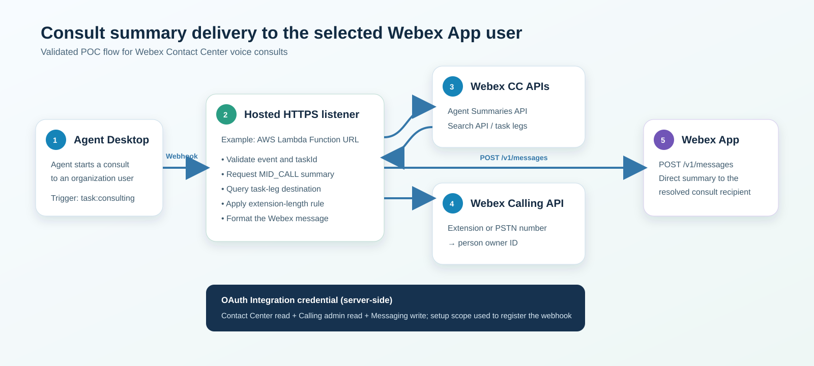
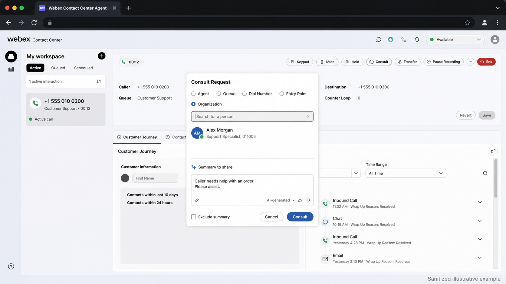
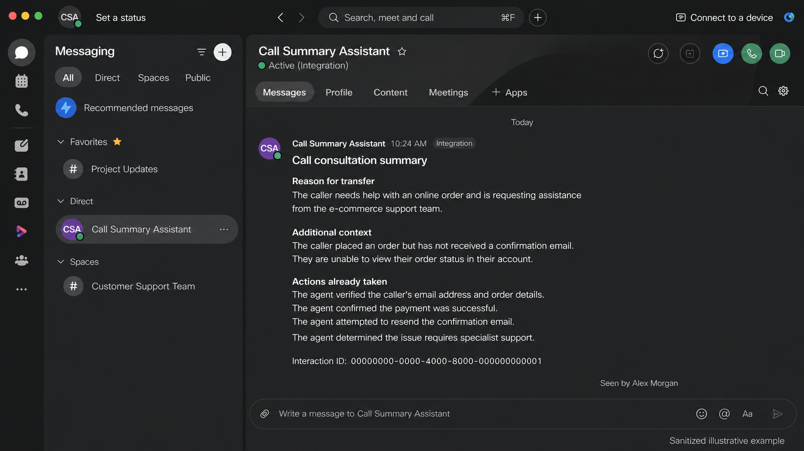

# Send a Consult Summary to the Consulted Webex User

## Summary

This playbook sends the Webex Contact Center AI-generated `MID_CALL` summary directly to the Webex user selected for a voice consult. It solves the handoff gap where the consulted user receives the call but may not have the caller context already captured by the first agent.

When the agent starts a consult, Webex Contact Center sends a `task:consulting` webhook to a hosted HTTPS listener. The listener uses the webhook `data.taskId` as the interaction ID, requests the summary, queries the interaction's task legs to find the real consult destination, resolves that extension or PSTN number to a Webex person, and sends the summary through Webex Messaging.

The webhook `data.destination` is the original entry-point DNIS. It is **not** the consult destination and must not be used to select the message recipient.



## Owner and maintenance

- Author: Dimitri Bokatov (`dbokatov`)
- Maintainer: FDE Team
- Last validated: 2026-09-02
- Version: 0.1.0

## Applicability

- Supported products/features: Webex Contact Center voice, AI Assistant call summaries, Webex Calling, and Webex Messaging
- Supported environment: HTTPS listener; the supplied implementation uses Node.js/TypeScript on an AWS Lambda Function URL
- Intended audience: Webex Contact Center administrators, solution architects, and developers
- When to use: A consult is placed to a Webex Calling user in the same Control Hub organization and that person should receive the call context privately
- When not to use: Queue, entry-point, hunt-group, workspace, Contact Center adapter, or other destinations that do not resolve to one Webex `PEOPLE` owner

This is a demo/POC implementation. It processes synchronously, performs one summary lookup and one Search lookup, and does not include webhook signature validation, retries, a queue, or duplicate-event protection.

## Prerequisites

### Webex organization and user

Create a **separate Webex user** for the integration. The user must:

1. Belong to the same Control Hub organization as the Contact Center and consulted Webex Calling users.
2. Have a Webex Contact Center license and an Administrator or Supervisor role that can use the Search and summary APIs.
3. Have the Control Hub administrative privileges required to read organization-wide Webex Calling number assignments. The `spark-admin` scope does not elevate a non-administrator.
4. Be able to use Webex Messaging because the integration sends the direct message on that user's behalf.
5. Own and authorize the OAuth Integration described below.

Use a non-human service identity where permitted by the organization's identity and licensing policies. Protect it with the organization's normal MFA, access-review, and offboarding controls. For long-lived, organization-wide production automation, reassess whether a Webex Contact Center Service App is more appropriate than a user-owned Integration.

### Product and deployment prerequisites

- Webex Contact Center AI Assistant summaries are enabled for the flow, queue, and test agents.
- The consult destination is assigned to exactly one Webex Calling user in the same organization.
- A public HTTPS listener is available. The webhook destination must use HTTPS and cannot contain query parameters.
- Node.js 24 or a compatible current release, npm, AWS CLI, AWS SAM CLI, and Docker for local SAM invocation.
- Permission to create a Contact Center webhook subscription.

## Implementation

### 1. Create the OAuth Integration

Sign in to [Webex for Developers](https://developer.webex.com) as the separate user:

1. Open **My Webex Apps**.
2. Select **Create a New App**.
3. Select **Create an Integration**.
4. Enter an application name, description, icon, and an OAuth redirect URI controlled by the implementation team.
5. Select the scopes below.
6. Save the Client ID and Client Secret. The secret is shown only once and must remain server-side.
7. Complete the OAuth authorization-code flow as the separate user, exchange the code for access and refresh tokens, and store the credentials securely.

Creating the Integration does not create a permanent API token. The access token is temporary; the listener must use the refresh token to obtain replacement access tokens.

### 2. Select minimum scopes

| Scope | Phase | Purpose |
|---|---|---|
| `cjp:config_read` | Runtime | Read `MID_CALL` summaries and query interaction task legs through Search |
| `spark-admin:telephony_config_read` | Runtime | Query organization Calling numbers and obtain the assigned `owner.id` |
| `spark:messages_write` | Runtime | Send the direct Webex message on behalf of the integration user |
| `spark:kms` | Runtime | Interact with encrypted Webex message content; Webex normally includes it for selected Integration scopes |
| `cjp:config_write` | Setup only | Create, update, or delete the Contact Center webhook subscription |

If webhook registration is performed with a separate administrator credential, the runtime listener does not need `cjp:config_write`. Do not request Calling or Contact Center write scopes for runtime processing.

### 3. Host the listener

Download or inspect the complete reusable implementation:

- [Download the TypeScript/AWS SAM source project (ZIP)](downloads/call-summary-transfer-lambda.zip)
- [Browse the source files on GitHub](https://github.com/WebexCC-SA/FDE-Playbook-Catalog/tree/main/Playbooks/consult-transfer-summary-to-webex/samples/lambda)

The source project uses this flow:

```text
Webex CC webhook
      ↓
AWS Lambda Function URL
      ↓
handler()
      ↓
Validate task:consulting and extract taskId and orgId
      ↓
Request MID_CALL summary
      ↓
Query Search API task legs using taskId
      ↓
Read nextDestination.agent.phoneNumber
      ↓
Resolve extension or PSTN number → Webex person ID
      ↓
POST the formatted summary to /v1/messages
```

Install, test, and build:

```bash
cd samples/lambda
npm ci
npm run quality
sam validate --lint
sam build
```

Deploy interactively:

```bash
sam deploy --guided
```

Use `DryRun=true` for the first deployment. The CloudFormation output named `WebhookUrl` is the public listener URL.

The sample AWS template uses a public Function URL (`AuthType: NONE`) to keep the POC simple. Anyone with that URL can invoke the function; do not use this ingress design unchanged in production.

### 4. Configure environment variables

Use [`samples/lambda/.env.example`](samples/lambda/.env.example) as the field reference. Never commit the populated environment file.

| Variable | Example | Purpose |
|---|---|---|
| `WXCC_API_BASE_URL` | regional API URL | Webex Contact Center API host for the tenant region |
| `WEBEX_ACCESS_TOKEN` | secret value | Temporary OAuth access token used by the POC |
| `WEBEX_ORG_ID` | optional organization ID | Fallback only when the webhook omits the organization ID |
| `EXTENSION_LENGTH` | `4` | Number of trailing digits that form an internal extension |
| `DRY_RUN` | `true` | Resolve and log without sending a message |
| `LOG_WEBHOOK_BODY` | `true` for controlled POC testing | Log the full webhook body; disable when full payload logging is no longer required |

#### Extension and PSTN handling

The demo uses four-digit extensions:

- A short digit-only dial string such as `011005` is treated as an internal dial string. With `EXTENSION_LENGTH=4`, the listener keeps `1005`; the leading `01` is automatically treated as the dialing prefix.
- There is no separate hard-coded prefix setting, so different prefixes work as long as the extension length is stable.
- A digit-only number containing at least ten digits, or a formatted PSTN number such as `+15550100200`, is preserved exactly as received.
- Values between the extension length and ten digits are rejected as ambiguous.

The resolved value is sent to `GET /v1/telephony/config/numbers` with `extension` for an extension or `phoneNumbers` for a PSTN number. Processing stops unless exactly one result has `owner.type=PEOPLE` and a non-empty `owner.id`.

### 5. Register the Contact Center webhook

1. Use the Contact Center Subscriptions API in the correct regional API host.
2. Register `task:consulting` for the `task` resource version returned by the List Event Types API.
3. Set `destinationUrl` to the deployed `WebhookUrl`; do not add query parameters.
4. Use an administrator token containing `cjp:config_write` for registration.
5. Confirm that the subscription is enabled and points to the expected URL.

Webhook delivery can be duplicated or arrive out of order. The POC accepts that risk; production implementations must add idempotency and asynchronous processing.

### 6. Switch from dry run to delivery

Perform a controlled consult while `DRY_RUN=true`, then confirm these structured log stages:

```text
webhook.parsed
webhook.resolved
summary.query
summary.resolved
consult-destination.query
consult-destination.response
consult-destination.resolved
calling-owner.resolved
message.dry-run
```

Verify that:

- `interactionId` equals webhook `data.taskId`;
- `midCallSummary` contains the expected `MID_CALL` content or is explicitly unavailable;
- `dialedNumber` is the actual consult destination from the task leg;
- `lookupNumber` is the intended four-digit extension or unchanged PSTN number;
- the Calling owner is the intended user and has type `PEOPLE`.

Only then update the existing Lambda configuration to `DRY_RUN=false`. Updating the function configuration does not change its Function URL, so the existing webhook subscription remains valid.

### 7. User experience examples

The following images are sanitized illustrative mockups derived from the validated workflow. They are not literal product screenshots and contain no source-customer identifiers.

**Agent starts a consult to an organization user**



**The consulted user receives the summary as a direct Webex message**



## Validation

### Automated validation

From `samples/lambda` run:

```bash
npm ci
npm run quality
sam validate --lint
sam build
```

Expected result: TypeScript type checking, all Node tests, the bundle build, SAM linting, and the SAM build complete successfully.

### End-to-end validation

1. Deploy with `DRY_RUN=true` and `LOG_WEBHOOK_BODY=true` in an approved test tenant.
2. Place a transcribed inbound call and wait until a `MID_CALL` summary is available.
3. Consult a Webex Calling user whose extension is present in Control Hub.
4. Confirm the listener logs the task ID, summary, task-leg destination, normalized lookup number, and intended `PEOPLE` owner.
5. Set `DRY_RUN=false` without replacing the Function URL.
6. Repeat the consult and confirm one direct message appears for the consulted user.
7. Confirm the message includes the transfer reason, additional context, actions already taken, and interaction ID. If the summary API returns no `MID_CALL` summary, confirm the no-summary message is delivered instead.

Expected result: the selected consult recipient receives the correct interaction context, and no other Webex user or general space receives it.

Rollback: set `DRY_RUN=true`, disable/delete the webhook subscription, or disable the Lambda while retaining logs needed for the approved investigation window.

## Operations and handoff

- Monitor `processing.failed`, API 401/403/404/429 responses, unmatched Calling numbers, unsupported owner types, and missing summary data.
- Refresh the OAuth token before expiry; do not manually replace it as the steady-state production design.
- Revalidate after Contact Center webhook or Search schema changes, Calling dial-plan changes, OAuth scope changes, or Lambda runtime upgrades.
- Production hardening should add webhook signature and timestamp validation, a fast `202 Accepted` response, a queue, retry/backoff, idempotency keyed by event/interaction/recipient, Secrets Manager, payload minimization, and alarms.
- The current code makes a single Search request at `task:consulting`; reporting data may not be available immediately. Add bounded retries before production use.
- Support owner: FDE Team. Escalate product/API issues through the standard Webex Contact Center support process with sanitized request IDs and timestamps.

## Security and privacy

- Call summaries, caller numbers, interaction IDs, and destination details can be personal or sensitive data. Confirm the legal basis, retention, recipient eligibility, and data residency requirements before enabling delivery.
- Store Client Secret, access token, and refresh token in a managed secret store. Never put them in source control, screenshots, browser code, logs, or the webhook URL.
- Restrict the separate Integration user and AWS operators to the minimum required roles; review access periodically.
- Set `LOG_WEBHOOK_BODY=false` after controlled diagnostics. Redact summaries, phone numbers, organization IDs, owner IDs, and interaction IDs from normal operational logs.
- Use encryption in transit and at rest, short log retention, and restricted CloudWatch access.
- Do not send a summary when the number lookup is missing, ambiguous, or resolves to a non-person owner.
- The supplied screenshots are synthetic, sanitized illustrations. Do not replace them with tenant screenshots until all personal and tenant-specific data has been removed.
- The POC Function URL has unauthenticated ingress and no signature verification. This is an explicit limitation, not a production recommendation.

## Evidence and outcomes

The implementation was validated on 2026-09-02 with a voice `task:consulting` event. The listener retrieved a populated `MID_CALL` summary, located the active consult task leg, converted a prefixed internal dial string to a four-digit extension, resolved a Webex Calling `PEOPLE` owner, and delivered a direct Webex message to that person.

The reusable evidence in this package is limited to sanitized code, synthetic sample data, automated tests, the architecture diagram, and the two illustrative UI examples. No customer name, tenant identifier, credential, real phone number, or live interaction ID is included.

## Troubleshooting

| Symptom | Likely cause | Corrective action |
|---|---|---|
| Summary was fetched but no message was sent | Recipient lookup failed or `DRY_RUN=true` | Inspect `consult-destination.resolved`, `calling-owner.resolved`, and `message.dry-run` |
| Lookup uses the entry-point DNIS | Webhook `data.destination` was treated as the consult target | Use Search task legs and `nextDestination.agent.phoneNumber` |
| `011005` does not match extension `1005` | Incorrect `EXTENSION_LENGTH` | Set it to the organization's extension length; for this demo use `4` |
| Calling lookup returns no result | Extension/PSTN is not assigned in Webex Calling or format differs | Test the exact `extension` or `phoneNumbers` filter in the same organization |
| Calling lookup returns unsupported owner type | Destination belongs to a queue, workspace, adapter, or service | Stop delivery or define a separately approved routing policy; do not guess a person |
| Search returns no consult leg | Task-leg reporting data is not ready | Add bounded retry/backoff and re-test event timing |
| Agent Summaries API returns no `MID_CALL` | Transcription/summary unavailable or not ready | Send the explicit no-summary message or add bounded retry, according to the use case |
| Webex API returns 401 | Access token expired | Refresh it using the OAuth refresh token |
| Webex API returns 403 | Scope or authorizing-user role is insufficient | Verify both the requested scopes and Control Hub roles |
| Duplicate messages appear | Webhook was delivered more than once | Add an idempotency record keyed by event ID, interaction ID, and recipient |

## References

- [Webex Integrations and OAuth](https://developer.webex.com/admin/docs/integrations)
- [Webex Contact Center Integration Scopes](https://developer.webex.com/webex-contact-center/docs/integration-scopes)
- [Webex Contact Center Webhooks](https://developer.webex.com/webex-contact-center/docs/using-webhooks)
- [Webex Contact Center webhook event payloads](https://developer.webex.com/webex-contact-center/docs/api/guides/webhooks-cc)
- [Webex Contact Center Subscriptions API](https://developer.webex.com/webex-contact-center/docs/api/v1/subscriptions)
- [Webex Contact Center Search API](https://developer.webex.com/webex-contact-center/docs/api/v1/search)
- [Agent Summaries: List Summaries](https://developer.webex.com/webex-contact-center/docs/api/v1/agent-summaries/list-summaries)
- [Webex Calling Numbers API](https://developer.webex.com/calling/docs/api/v1/numbers/get-phone-numbers-for-an-organization-with-given-criteria)
- [Webex Messaging: Create a Message](https://developer.webex.com/messaging/docs/api/v1/messages/create-a-message)
- Source engagement: [CCC-3730](https://imimobile.atlassian.net/browse/CCC-3730) (internal access required)
