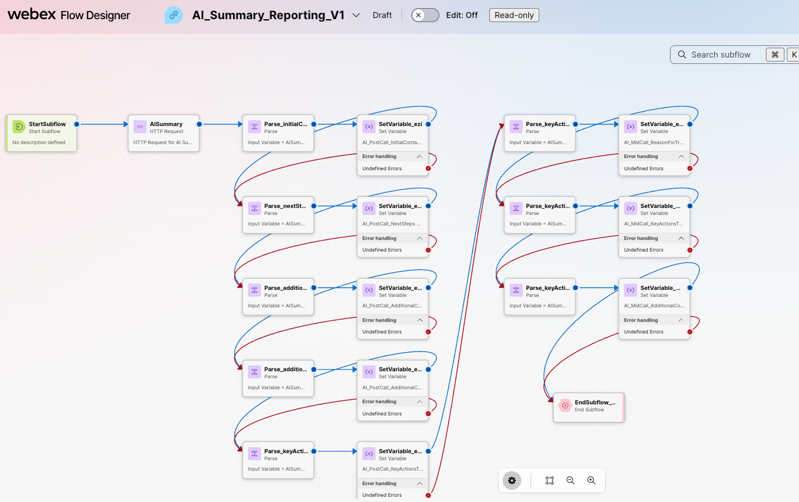

# Retrieve AI Assistant Post-Call Summaries for Supervisor Reporting

## Summary

This playbook retrieves Webex Contact Center AI Assistant `POST_CALL` summaries after a voice interaction ends, stores five summary components in reportable global variables, and exposes them in a historical Analyzer report for supervisors.

## Owner and maintenance

- Owner: Geovanny Olivares
- Maintaining team: FDE Team
- Version: 0.1.0
- Source engagement: [CCC-3812](https://imimobile.atlassian.net/browse/CCC-3812) (internal)

## Applicability

### Issue

Supervisors need historical visibility into AI-generated wrap-up summaries across multiple interactions. Analyzer can report the values after the flow retrieves the summary and saves its components in reportable global variables.

## Prerequisites

- AI Assistant wrap-up summaries enabled for the target voice queues.
- A FLEX3 Webex Contact Center organization when using the Webex Contact Center HTTP connector.
- Access to manage flows, subflows, global variables, and connectors in Control Hub.
- Analyzer administrator access to import the supplied visualization.
- A parent voice flow that uses `Queue Contact`, which exposes `PhoneContactEnded`.

## Implementation

### Proposed solution

```text
PhoneContactEnded
  -> Wait
  -> AI summary subflow
  -> POST /generated-summaries/search
  -> Parse POST_CALL fields
  -> Map outputs to reportable global variables
  -> Analyzer historical report
  -> Supervisor Desktop
```



### Configuration

1. **Create the variables.** Define these String global variables in Control Hub:

   | Variable | Reportable |
   | --- | --- |
   | `AI_PostCall_InitialContactReason` | Yes |
   | `AI_PostCall_KeyActionsTaken` | Yes |
   | `AI_PostCall_NextSteps` | Yes |
   | `AI_PostCall_AdditionalContext` | Yes |
   | `AI_PostCall_AdditionalContactReasons` | Yes |
   | `AI_InteractionId` | No |

   Add the variables to the parent flow. Set `AI_InteractionId` to `{{NewPhoneContact.InteractionId}}` before the contact reaches `Queue Contact`. Global String variables support up to 1024 characters during flow execution.

2. **Create and invoke the subflow.** Define String inputs for the organization ID and interaction ID, String outputs for the five summary fields, and local variables for the HTTP response. A subflow cannot contain global variables directly, so map the parent variables to the subflow inputs and map the outputs back to the reportable global variables. Invoke it from `PhoneContactEnded` after a bounded Wait. The reference implementation starts with five seconds; validate the timing in the target organization.

3. **Configure the API request.** Use an authenticated Webex Contact Center HTTP connector and the [List Summaries API](https://developer.webex.com/webex-contact-center/docs/api/v1/agent-summaries/list-summaries):

   - Method: `POST`
   - Request path: `/generated-summaries/search`
   - Content type: `Application/JSON`
   - Headers: `Accept: application/json` and `Content-Type: application/json`
   - Body:

   ```json
   {
     "searchType": "INTERACTION",
     "orgId": "{{organizationId}}",
     "interactionId": "{{interactionId}}"
   }
   ```

   Use a finite timeout and retry count. The HTTP Request retry setting applies to `5xx` responses; handle a successful response with no summary through explicit flow logic.

4. **Parse the response.** Apply these JSONPath expressions to the HTTP response body:

   | Output | JSONPath |
   | --- | --- |
   | Initial contact reason | `$.summaries.POST_CALL..initialContactReason` |
   | Key actions taken | `$.summaries.POST_CALL..keyActionsTaken` |
   | Next steps | `$.summaries.POST_CALL..nextSteps` |
   | Additional context | `$.summaries.POST_CALL..additionalContext` |
   | Additional contact reasons | `$.summaries.POST_CALL..additionalContactReasons` |

   Return the parsed values through the subflow outputs. Treat every summary component as optional and route HTTP or parsing failures through a controlled error path.

5. **Publish the flows.** Validate and publish the subflow, select its version or version label in the parent flow, map inputs and outputs using matching data types, and republish the parent flow. Subflow changes do not affect live behavior until the parent flow is republished.

6. **Import the report.** In Analyzer, open **Visualization**, select **Import**, and choose `settings/AI Summary CSR Report_2026-09-09-15-33-38.json`. Open the imported visualization in Edit mode and verify its global-variable fields, filters, folder, and permissions.

7. **Expose it to supervisors.** The Analyzer widget is available by default on the Desktop Home Page for `supervisor` and `supervisorAgent`. Ensure the supervisor profile and report folder permissions provide access. If a custom desktop layout is used, retain the Analyzer widget and assign the layout to the correct teams.

## Validation

### Expected outcomes

- `PhoneContactEnded` invokes the subflow after the configured Wait.
- The five `POST_CALL` values are stored in their reportable global variables.
- The imported Analyzer visualization displays the summary fields with the matching interaction records.
- Authorized supervisors can access the report from Supervisor Desktop.

Test a normal call, a response with missing summary components, an authorization or `5xx` failure, and a transferred or multi-segment interaction. Validate transfer and multi-segment correlation in every target organization.

## Security and privacy

- Keep API authorization in the connector; do not place credentials in flow or report exports.
- Restrict Analyzer folders and Supervisor Desktop access to authorized teams.
- Treat ANI, DNIS, summaries, transcripts, and interaction IDs according to the organization's privacy and retention policies.
- Do not log the full API response in production.

## Troubleshooting

| Symptom | Check |
| --- | --- |
| No summary is returned | Confirm AI Assistant enablement, interaction ID, connector access, and Wait timing. |
| API returns `401` or `403` | Verify connector authorization and the permissions assigned to it. |
| API returns `5xx` | Confirm the finite retry configuration and route exhausted retries to the error path. |
| Analyzer fields are empty | Verify subflow output mappings, matching data types, and the Reportable setting on each `AI_PostCall_*` variable. |
| Supervisor cannot see the report | Verify Analyzer access, report folder permissions, team scope, and desktop layout assignment. Reload Desktop after layout changes. |

## References

- [Webex Contact Center List Summaries API](https://developer.webex.com/webex-contact-center/docs/api/v1/agent-summaries/list-summaries)
- [Build and manage flows with Flow Designer](https://help.webex.com/article/nhovcy4)
- [Create Webex Contact Center HTTP connector](https://help.webex.com/article/n54f5wd)
- [Cisco Webex Contact Center Analyzer User Guide](https://help.webex.com/article/tajemk/Cisco-Webex-Contact-Center-Analyzer-User-Guide)
- [Create custom desktop layouts](https://help.webex.com/article/ng08gqeb/Create-custom-desktop-layout)
- [CCC-3812 — source FDE engagement](https://imimobile.atlassian.net/browse/CCC-3812) (internal)
- `CAUI-13167` — related internal AI Assistant enhancement tracking
